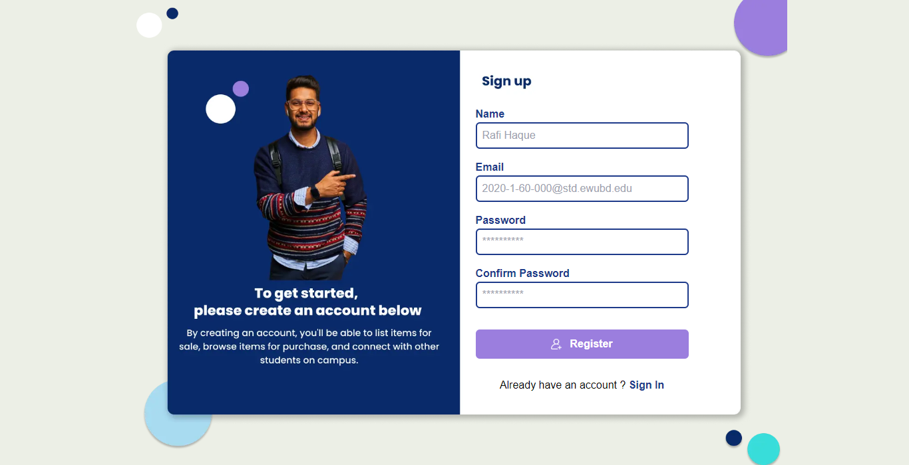

# EWU Traders: Online Marketplace for EWU Students

EWU Traders is an online marketplace designed specifically for EWU students, built with React.js for the front-end, Node.js for the back-end, and MySQL for database management. It provides students with a convenient platform to buy and sell second-hand items within the university community.





## Features

- **User Authentication**: Secure login and registration system tailored for EWU students.
- **Product Listings**: Browse through a variety of second-hand products listed by fellow EWU students.
- **Advanced Search**: Find products quickly with advanced search and filtering options based on categories, prices, and conditions.
- **Product Details**: View detailed information about each product, including descriptions, prices, and images.
- **Chat Functionality**: Communicate with sellers and potential buyers via integrated chat functionality.
- **Secure Transactions**: Conduct secure transactions with built-in payment options and escrow services.
- **Profile Management**: Manage user profiles, including listings, orders, and chat history.

## Technologies Used

- **Front-end**: React.js
- **Back-end**: Node.js
- **Database**: MySQL

## Installation

1. Clone the repository: `git clone https://github.com/fajlay-rabbi/ewu_trader.git`
2. Navigate to the project directory: `cd ewu-student-marketplace`
3. Install dependencies for the client and server:
   ```bash
   cd client
   npm install
   cd ../server
   npm install

Set up the MySQL database according to the schema provided.
Start the server: npm start (in the server directory)
Start the client: npm start (in the client directory)
Visit http://localhost:3000 in your browser to access the application.

